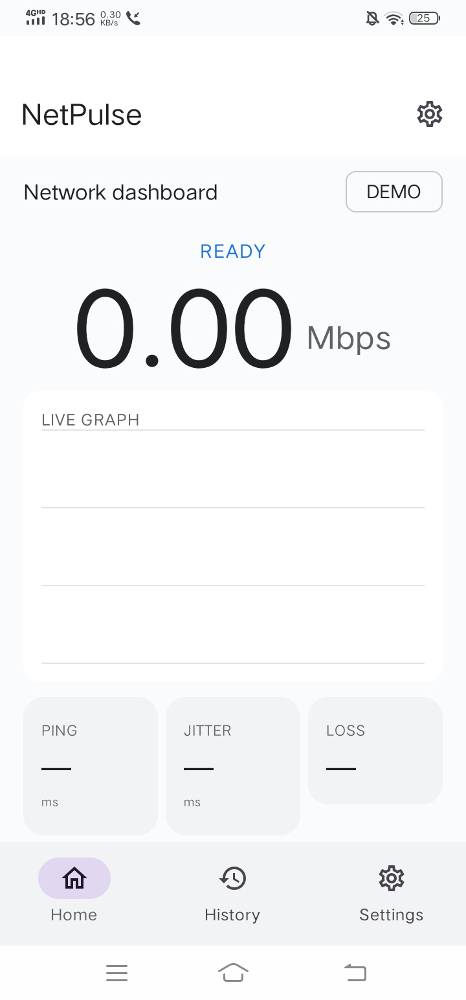
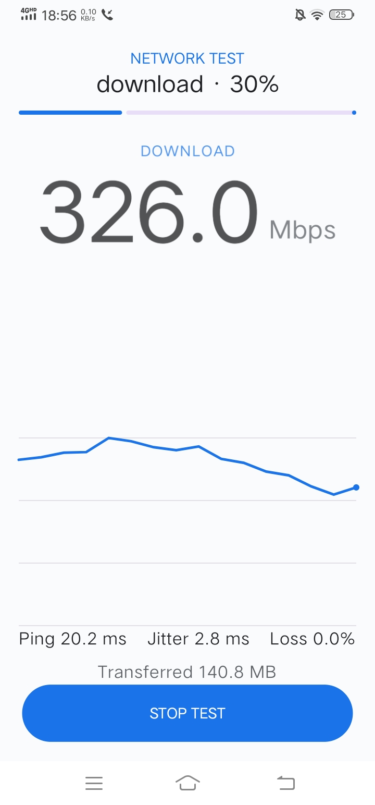
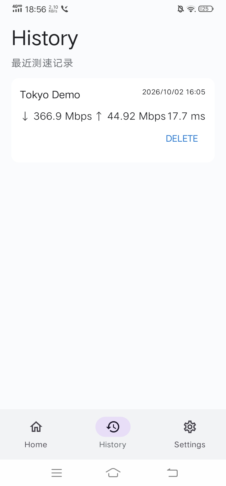
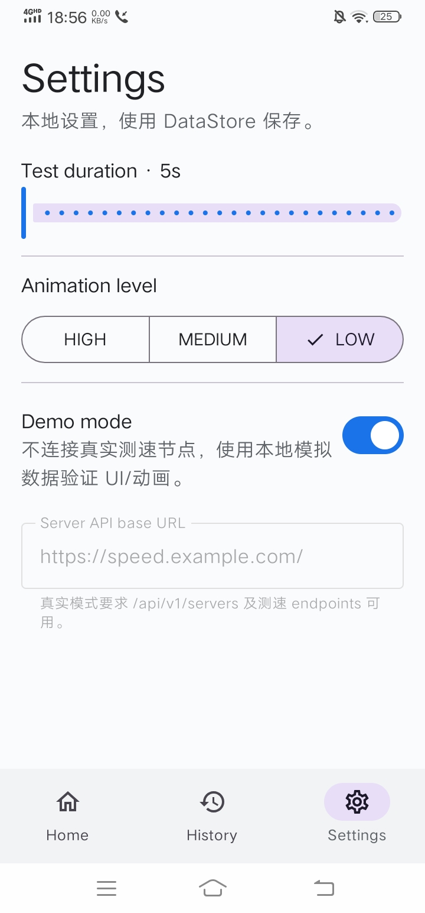

<div align="center">
  

  <h1>NetPulse</h1>
  <p><strong>高动态网速测试软件 / High-dynamic network speed testing for Android</strong></p>
  <p><a href="./README.md">English / 英文</a> · <a href="https://github.com/fcs666fcs/NetPulse/releases">Releases / 下载</a></p>
</div>

---

## 中文

### 项目简介

NetPulse 是一款面向 Android 的高动态网速测试软件，核心目标不是只显示一个最终数字，而是把测速过程本身做成实时、连续、可观察的数据体验。

项目采用 **Kotlin + Jetpack Compose + Material 3 + Canvas**，围绕测速状态流实时更新速度、Ping、Jitter、Packet Loss 和曲线，并使用分级动画让数据变化更直观。项目设计同时强调：**显示平滑只服务于视觉，最终结果必须来自原始采样聚合。**

当前公开版本为 **v1.0.0**。

### 下载

**Android APK：** [NetPulse v1.0.0 Releases](https://github.com/fcs666fcs/NetPulse/releases)

首次运行默认进入 **Demo Mode**。Demo Mode 不连接真实测速节点，而是生成本地模拟数据，用于快速预览 UI、Canvas 曲线、状态机和动画。

### 截图

<table>
  <tr>
    <td align="center"><br /><sub>Home / 首页</sub></td>
    <td align="center"><br /><sub>Live Test / 实时测速</sub></td>
  </tr>
  <tr>
    <td align="center"><br /><sub>History / 历史记录</sub></td>
    <td align="center"><br /><sub>Settings / 设置</sub></td>
  </tr>
</table>

### 核心功能

| 功能 | 说明 |
| --- | --- |
| **Download / Upload** | 多并发下载与上传测速，实时反馈吞吐变化 |
| **Ping / Jitter / Loss** | 同时观察基础延迟、时延波动和丢包 |
| **Real-time Graph** | Canvas 绘制实时速度曲线，固定窗口显示最新采样 |
| **Dynamic Animation** | HIGH / MEDIUM / LOW 三级动画强度，可按设备能力调整 |
| **Large Speed Hero** | 用大数字突出当前测速值，配合 EMA 平滑改善视觉抖动 |
| **History** | 使用 Room 保存本地测速记录，支持查看和删除 |
| **Settings** | DataStore 保存测试时长、动画等级、Demo Mode、服务端 API URL |
| **Result / Share** | 完成测速后展示结果，并支持系统分享 |
| **Custom Server API** | 通过 `/api/v1/servers` 获取可用测速节点 |
| **Self-hosted Backend** | 提供 Node.js + Docker 服务端实现，支持自建测速基础设施 |

### 测速流程

```text
Launch
  ↓
Load Network Snapshot
  ↓
Home Dashboard
  ↓ Start
Server Selection
  ↓
Ping Baseline
  ↓
Download
  ↓
Upload
  ↓
Analysis
  ↓
Result Dashboard
  ↓
Save Local Record
```

### 数据与测量原则

NetPulse 将 **Raw Sample（原始采样）** 与 **Display State（展示状态）** 分开处理：

```text
Raw Sample Stream
       ↓
 throttle / aggregate
       ↓
 Display State
       ↓
 StateFlow
       ↓
 Compose / Canvas
```

核心约束：

- UI 可以平滑速度曲线，但平滑后的值不能回写最终结果。
- Download / Upload 最终值来自有效采样窗口的聚合统计，peak 作为辅助数据。
- Jitter 使用相邻 RTT 差值的平均绝对值。
- Packet Loss = failed / sent × 100。
- 测速结果是一次测量，不代表线路在所有时间、设备和网络条件下的绝对速度。

### Android 架构

```text
Compose UI
   ↓
AppViewModel / StateFlow
   ↓
SpeedTestEngine
   ├─ ServerRepository
   ├─ PingTester
   ├─ DownloadTester
   ├─ UploadTester
   └─ ResultAggregator
   ↓
OkHttp / Retrofit

History: ViewModel → HistoryRepository → Room
Settings: ViewModel → SettingsRepository → DataStore
```

项目刻意保持 **UI、ViewModel、Domain、Repository、Data** 分层，测速引擎不依赖 Compose，便于测试、性能优化和后续扩展。

### 项目结构

```text
NetPulse/
├─ app/                    # Android application
├─ server/                 # Node.js speed test backend
├─ docs/                   # Project and engineering documents
├─ .github/workflows/      # GitHub Actions
├─ build.gradle.kts
├─ settings.gradle.kts
└─ README.md
```

### 本地开发

**环境：**

- Android 8.0+ / minSdk 26
- Java 17
- Android SDK 37
- Build Tools 36.x
- Android Studio
- Gradle 9.6.0
- Android Gradle Plugin 9.4.0

克隆项目后，使用 Android Studio 打开仓库并同步 Gradle。

也可以直接使用 Gradle Wrapper 构建 Debug APK：

```bash
./gradlew :app:assembleDebug
```

Windows PowerShell：

```powershell
.\gradlew.bat :app:assembleDebug
```

### Demo Mode → 真实测速

真实测速需要一个可用的控制/API 服务。

在 App → **Settings** 中：

1. 关闭 **Demo Mode**。
2. 设置 `Server API base URL`，例如 `https://speed.example.com/`。
3. 服务端提供 `GET /api/v1/servers`。
4. 返回 Home 后启动测速。

### 自建测速服务端

进入 `server/`：

```bash
npm install
PUBLIC_BASE_URL=https://speed.example.com npm start
```

Docker：

```bash
docker build -t netpulse-server ./server

docker run --rm -p 8080:8080 \
  -e PUBLIC_BASE_URL=http://localhost:8080 \
  netpulse-server
```

Android 模拟器访问宿主机时可使用：

```text
http://10.0.2.2:8080/
```

真机测试则使用电脑在局域网中的地址。生产环境建议使用 HTTPS，并把测速节点部署在带宽足够的服务器出口上。

### API

服务器列表：

`GET /api/v1/servers`

```json
{
  "version": 1,
  "servers": [
    {
      "id": "tokyo-01",
      "name": "Tokyo 01",
      "region": "JP",
      "baseUrl": "https://speed.example.com",
      "weight": 1
    }
  ]
}
```

测速节点接口：

| Endpoint | Method | 用途 |
| --- | --- | --- |
| `/empty?seq=1` | GET | Ping / RTT |
| `/download?bytes=16777216` | GET | 不可缓存下载数据 |
| `/upload` | POST | 上传测速 payload |
| `/health` | GET | 健康检查 |
| `/meta` | GET | 服务端元信息 |

### GitHub Actions

项目使用 GitHub Actions 完成远程构建与检查：

| Workflow | 用途 |
| --- | --- |
| `android-check.yml` | lint + unit test |
| `android-build.yml` | Debug APK 构建 |
| `android-release.yml` | Release 构建流程，占位以接入签名 Secret |

当前 workflow 设计为 **手动触发**，适合把 GitHub Actions 当作云端 Android 构建机，避免每次提交都自动消耗构建资源。

### 隐私与安全

NetPulse 的测速本身不要求账号体系；历史记录保存在本地数据库。项目规范要求对 IP、运营商、地理位置等网络元数据实行最小化保存原则，并在需要时让用户明确知道数据用途。

服务端需要注意 HTTPS、缓存控制、上传体积限制、并发限制和基础限流，避免测速节点被无限占用。

### Roadmap

#### v1.0

- [x] Download / Upload
- [x] Ping / Jitter / Loss
- [x] 实时速度曲线
- [x] 动画分级
- [x] 历史记录
- [x] DataStore 设置
- [x] Demo Mode
- [x] GitHub Actions Debug APK
- [x] Node.js + Docker 服务端

#### v1.5+

- [ ] 稳定性测试
- [ ] CSV 数据导出
- [ ] 更丰富的趋势 / 对比图表
- [ ] IPv4 / IPv6 对比
- [ ] DNS 测试
- [ ] Wi-Fi 信道信息
- [ ] 局域网测速
- [ ] 更多测速节点与节点健康监控

### 参与贡献

欢迎提交 Issue、Pull Request 和改进建议。

建议在提交代码前至少完成：

```bash
./gradlew :app:lintDebug
./gradlew :app:testDebugUnitTest
```

复杂 UI 组件应优先保持可 Preview；动画不能阻塞测速线程；新增视觉效果不能改变测速最终统计逻辑。

### 作者

**fu chuansheng**

GitHub: [@fcs666fcs](https://github.com/fcs666fcs)

### License

当前仓库页面尚未声明 `LICENSE` 文件。正式对外分发和允许他人再发布前，请在仓库根目录补充项目实际采用的开源许可证。

---

